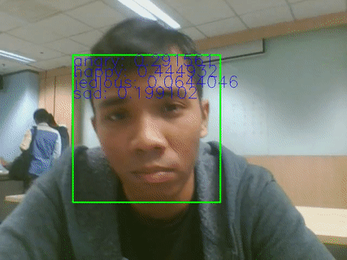
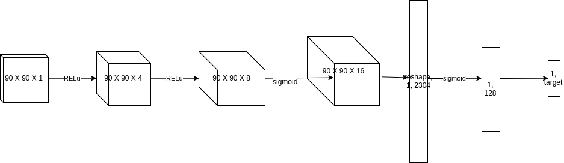
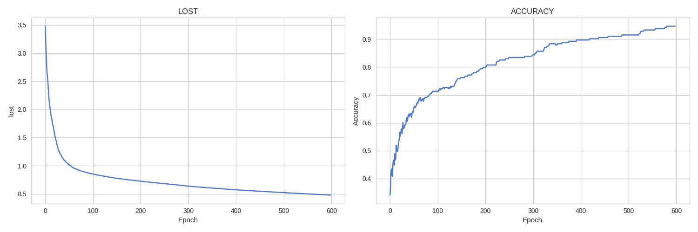

# Real-time-Emotion-Detection-CNN
Classify probability distribution for emotion on any camera using Deep Convolutional Network.



This time I trained 4 layers of Neural Network, 3 Convolutional layers with Max Pooling, Single layer of 2D linear, {RELu, RELu, sigmoid, sigmoid}

Our network looks like diagram below


#### Dependencies needed:
```bash
sudo apt-get install libopencv-dev python-opencv
```

#### How to train new emotion:
1. Create a new folder name 'detectface' in this folder
2. Create a new subfolder any related name with emotion in detectface folder, e.g {happy, sad, angry, jealous}
3. Put samples in related folder
4. run 'python train.py'

Make sure check settings.py before train and test
```text
import os

location = '/home/project/emotion/facedata/'
current_location = os.getcwd()

picture_dimension = 90
learning_rate = 0.001

enable_dropout = False
dropout_probability = 0.2

enable_penalty = False
penalty = 0.0005
batch_size = 10
epoch = 1000
```

#### After trained for 600 epoch, took about an hour and half.



